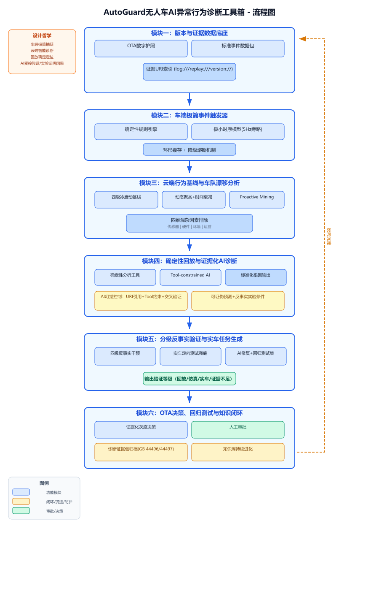

<div align="center">

# 🛡️ AutoGuard AI

### Agent-Driven Autonomous Vehicle Anomaly Diagnosis Toolkit

面向自动驾驶研发团队的 OTA 影响分析、异常检测、根因诊断与反事实验证工具箱。

[](https://github.com/npy2018/AutoGuard-Autonomous-Vehicle-Anomaly-Diagnosis-Toolkit/actions/workflows/ci.yml)
[](https://www.python.org/)
[](https://fastapi.tiangolo.com/)
[](LICENSE)
[](#项目状态)

</div>

## 项目简介

自动驾驶系统在持续 OTA 迭代过程中，可能出现感知误判、异常制动、轨迹偏差、策略退化或版本迁移问题。传统排查往往依赖工程师手工比对版本变更、车辆日志、环境因素和回放结果，耗时较长，也难以保证诊断过程可追踪、可复现。

AutoGuard AI 将这一过程组织为一个 Agent 驱动的诊断闭环：

> **版本与证据整理 → 异常事件触发 → 行为基线分析 → 根因诊断 → 反事实验证 → OTA 决策支持**

系统不直接替代工程师做安全结论，而是提供结构化证据、根因候选、验证任务和人工审批入口。

## 项目结构

AutoGuard-Autonomous-Vehicle-Anomaly-Diagnosis-Toolkit/
├── app/
│   ├── api/                  # API 接口
│   ├── services/             # 核心诊断服务
│   ├── static/               # Web 页面资源
│   ├── main.py               # FastAPI 入口
│   └── schemas.py            # 数据模型
├── data/                     # 示例诊断数据
├── docs/
│   └── assets/
│       └── autoguard-architecture.png
├── scripts/
│   └── run_demo.py           # 命令行演示
├── tests/                    # 自动化测试
├── .github/workflows/ci.yml  # GitHub Actions
├── Dockerfile
├── docker-compose.yml
├── pyproject.toml
└── README.md

## 系统架构

<p align="center">
  AutoGuard-Autonomous-Vehicle-Anomaly-Diagnosis-Toolkit/
├── app/
│   ├── api/                  # API 接口
│   ├── services/             # 核心诊断服务
│   ├── static/               # Web 页面资源
│   ├── main.py               # FastAPI 入口
│   └── schemas.py            # 数据模型
├── data/                     # 示例诊断数据
├── docs/
│   └── assets/
│       └── autoguard-architecture.png
├── scripts/
│   └── run_demo.py           # 命令行演示
├── tests/                    # 自动化测试
├── .github/workflows/ci.yml  # GitHub Actions
├── Dockerfile
├── docker-compose.yml
├── pyproject.toml
└── README.md
  
  
</p>

AutoGuard AI 由六个核心模块组成：

1. **版本与证据数据库底座**：管理 OTA 数字护照、标准事件数据包和证据 URI。
2. **车辆极简事件触发器**：通过确定性规则和轻量时序模型定位异常片段。
3. **云端行为基线与车队漂移分析**：识别版本、区域、环境和时间维度上的行为偏移。
4. **确定性回放与证据化 AI 诊断**：结合工具调用、证据引用和标准化根因输出进行辅助诊断。
5. **分级反事实验证与实车任务生成**：通过仿真、回放和实车定向测试验证根因。
6. **OTA 决策、回归测试与知识闭环**：支持灰度发布、人工审批、诊断归档和知识库更新。

## 核心能力

- **OTA 影响分析**：识别软件版本变化可能影响的感知、规划、控制和环境适应模块。
- **异常检测**：定位急刹、偏航、误检和行为退化等异常事件。
- **根因分析**：结合日志、版本信息、环境条件和回放结果生成根因候选。
- **反事实验证**：通过参数扰动、场景重放和条件实验验证异常是否与特定因素有关。
- **证据链管理**：保留数据来源、中间结果、工具调用和诊断依据。
- **Agent 编排**：自动完成任务规划、模块调用、结果验证和报告生成。

## 内置案例

仓库内置一个 OTA 更新后的雨夜误刹案例：车辆在新版本下将路侧广告牌误识别为风险目标并触发制动。系统会自动分析版本差异、过滤环境混杂因素、生成根因候选，并给出反事实验证和发布建议。

## 快速开始

```bash
git clone https://github.com/npy2018/AutoGuard-Autonomous-Vehicle-Anomaly-Diagnosis-Toolkit.git
cd AutoGuard-Autonomous-Vehicle-Anomaly-Diagnosis-Toolkit

python -m venv .venv
