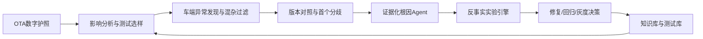

# Architecture

## One data foundation, six modules

## Runtime layers

### Vehicle-side observer

- Read-only shadow observer
- Behavior envelope
- Time-series anomaly detection
- OOD scoring
- Sensor and hardware health checks
- Event snapshot trigger

### Cloud diagnosis plane

- OTA passport and change graph
- Module replay or end-to-end trajectory comparison
- Historical case retrieval
- Evidence-grounded multi-agent diagnosis
- Counterfactual experiment orchestration
- Technical evidence package generation

## Current repository implementation

The repository implements the full contract and an executable vertical slice. Components that require vehicle proprietary systems are represented by stable adapters or deterministic MVP engines so that the workflow can be demonstrated offline.
